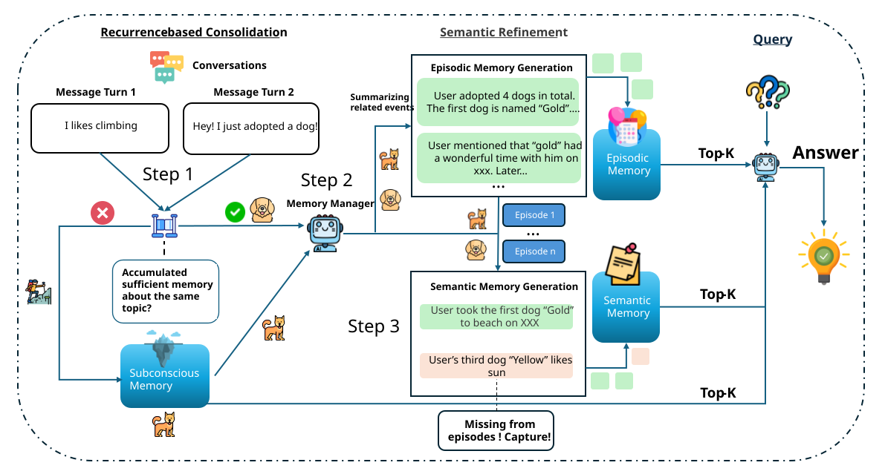
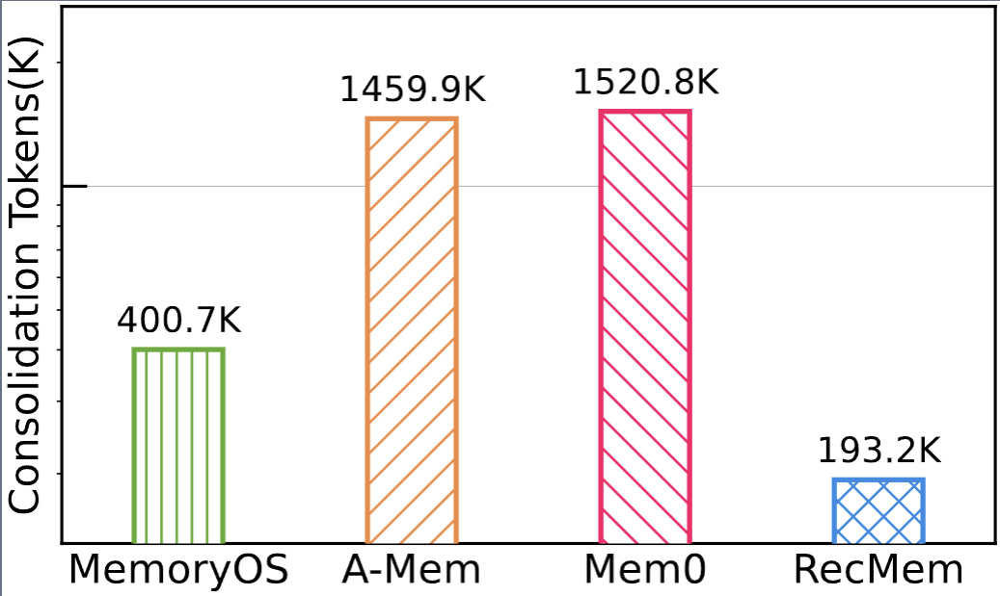
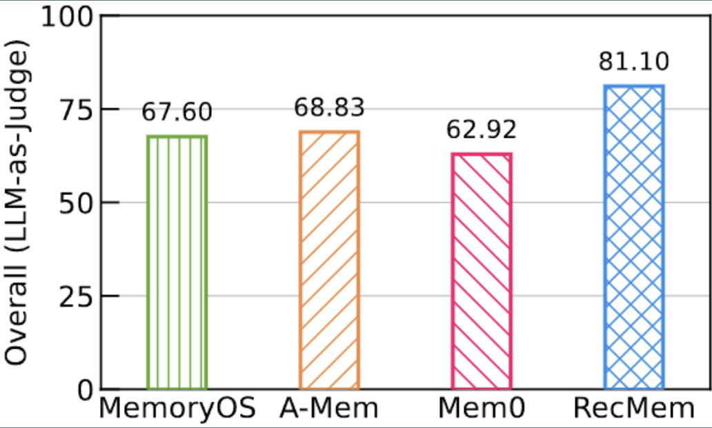

This repository contains the implementation of the paper **"RecMem:
Recurrence-based Memory Consolidation for Efficient and Effective Long-Running
LLM Agents"**.

# Latest News

- 📌 Our paper has been accepted to **ACL 2026 Findings**!
- **2026-05-15** — We are happy to open-source the RecMem. We are actively polishing this repository to improve the experience of both reproducing experiments and using RecMem in practice.

# Why RecMem?

## Motivation

Existing memory systems for long-running LLM agents suffer from two fundamental inefficiencies:

**① Eager consolidation wastes tokens.** Most systems invoke an LLM to process every incoming interaction — extracting facts, updating graphs, rewriting summaries — regardless of whether the content actually warrants long-term storage. Casual chit-chat, one-off remarks, and redundant turns all pay the same LLM tax as genuinely important information. In streaming deployments where turns arrive continually, this overhead accumulates fast and quickly dominates total cost.

**② Single-facet extraction loses details.** Whether a system distills interactions into event summaries, atomic facts, or graph triplets, committing to one representation inevitably discards information that doesn't fit the chosen format. Event-level summaries compress away fine-grained facts; atomic facts lose narrative coherence; graphs lose context. Once lost at ingestion time, these details are unrecoverable at query time.

## Our approach: Recurrence-based Consolidation

RecMem rethinks **when** and **how** memory consolidation should happen, inspired by the multi-store theory of human memory:

- **Defer, don't eagerly extract.** Incoming interactions are buffered in a lightweight subconscious layer with embedding-based indexing — no LLM involved. Consolidation is triggered only when an interaction finds a sufficient number of semantically similar predecessors, i.e., when recurrence indicates the content is genuinely worth promoting.
- **Capture both events and facts.** Once triggered, RecMem produces an episodic abstraction for narrative coherence, then applies semantic refinement to recover fine-grained details the episode compressed away. The two layers complement rather than compete.

<p align="center">
  
</p>

## The result

- 🚀 **Up to 7.8× lower construction cost** than prior memory systems on Locomo benchmark
- 🎯 **Higher overall accuracy** on both LoCoMo and LongMemEval-S, despite spending far fewer tokens
- 🧩 **Modular three-tier architecture** — swap the embedder, LLM backend, or any individual memory tier without touching the rest
- 🔁 **Reproducible in one command** — parallel-evaluation harness included; thanks to RecMem's lightweight design, replicating our full results is fast and cheap

<p align="center">
  
  
</p>

For the full story — benchmarks, ablations, hyperparameter analysis, and design rationale — see our paper: *RecMem: Recurrence-based Memory Consolidation for Efficient and Effective Long-Running LLM Agents.*

# Contents

This repository contains the source code and evaluation code for RecMem.

```
recmem/        # library code — core RecMem logic
evaluation/    # benchmark runners, metrics, dataset loaders
```

The core logic of RecMem lives in `recmem/rec_mem.py`, and the evaluation entry
point is `evaluation/run_experiments.py` (run as `python -m evaluation.run_experiments`).

> **Model support:** RecMem currently only supports OpenAI models for both the
> LLM client and embeddings. Using other providers may produce errors. Broader
> model support is actively in development.

# Experiment Setup

You can manage the environment with either **Miniconda** or **uv**. Pick one.

## Option 1: Miniconda

```bash
# Create a new conda environment with Python 3.9
conda create -n recmem python=3.9 -y

# Activate the environment
conda activate recmem

# Install dependencies
pip install -r requirements.txt
```

## Option 2: uv

The project ships with `pyproject.toml` and `.python-version`, so `uv sync` will
create a `.venv` pinned to Python 3.9 and install all dependencies (and write a
reproducible `uv.lock`).

```bash
# Create .venv and install dependencies (uses .python-version → 3.9)
uv sync

# Run commands inside the env
uv run python -m evaluation.run_experiments ...
# or activate the venv directly
source .venv/bin/activate
```

If you prefer to keep using `requirements.txt` with uv, that also works:

```bash
uv venv --python 3.9
source .venv/bin/activate
uv pip install -r requirements.txt
```

### Optional metrics (not needed for the default benchmark)

The default benchmark only uses BLEU + F1 + LLM-judge. ROUGE / BERTScore /
sentence-similarity functions exist in `evaluation/metrics/utils.py` but their
backends (`bert-score`, `rouge-score`, `sentence-transformers`) are kept out of
the base install — they pull in heavy ML libraries and download multi-hundred-MB
checkpoints on first use. Install them only if you plan to call those metrics
directly:

```bash
# with pip
pip install -r requirements-extra-metrics.txt

# with uv (editable + extras)
uv sync --extra extra-metrics
```

The first BLEU call still triggers a small (~5 MB) `nltk punkt` download
automatically.

## Dataset Preparation

RecMem supports two benchmarks: **LoCoMo** and **LongMemEval-S**.

### LoCoMo Dataset

Download the LoCoMo dataset and place it in the `dataset/Locomo/` directory:

```bash
mkdir -p dataset/Locomo
```

You may find the dataset [here](https://github.com/snap-research/locomo)

### LongMemEval-S Dataset
Download the LongMemEval-S dataset and place it in the `dataset/LongMemEval/` directory:

```bash
mkdir -p dataset/LongMemEval
```
Note that we use the latest clean version of LongMemEval-S. And you may find the link [here](https://huggingface.co/datasets/xiaowu0162/longmemeval-cleaned)

## Configuration
Make sure you have a `.env` file and have the following entries:

```bash
# ============ Required ============
OPENAI_API_KEY=your-api-key-here

# ============ Optional ============
# Custom OpenAI-compatible endpoint (relay/proxy). Either name works;
# OPENAI_API_BASE takes precedence over OPENAI_BASE_URL when both are set.
# OPENAI_BASE_URL=https://your-relay.example.com/v1
# OPENAI_API_BASE=https://your-relay.example.com/v1

# ============ LoCoMo Benchmark Paths ============
LOCOMO_PATH=/path/to/dataset/Locomo/xxx.json
LOCOMO_SCORE_PATH=/path/to/RecMem/results/Locomo/scores/

# ============ LongMemEval-S Benchmark Paths ============
LONGMEMEVAL_S_PATH=/path/to/dataset/LongMemEval/xxx.json
LONGMEMEVAL_S_SCORE_PATH=/path/to/RecMem/results/LongMemEval/scores/
```

# Run evaluation.

To reproduce our results on Locomo and LongMemEval-S, you will need paths
where you want to store memory modules and result output. Run the following configurations:

Run the commands below from the **repository root** so that the `recmem` and
`evaluation` packages are on Python's import path.

```bash
# Locomo
python -m evaluation.run_experiments --min_consolidation_cnt 5 \
    --min_relevant_score 0.7 \
    --retrieve_raw_topk 10 \
    --retrieve_epi_topk 5 \
    --merge_with_epi_thresh 0.7 \
    --model <model_name> \
    --semantic_memory_topk 10 \
    --semantic_memory_threshold 0.0 \
    --enable_stat \
    --semantic_store <Path to store semantic memory> \
    --subconscious_store <Path to store subconscious memory> \
    --episodic_store <Path to store episodic memory> \
    --bench locomo \
    --question_max_workers 20 \
    --output_file <output_file_path>

# LongMemEval-S
python -m evaluation.run_experiments --min_consolidation_cnt 4 \
    --min_relevant_score 0.6 \
    --retrieve_raw_topk 10 \
    --retrieve_epi_topk 5 \
    --merge_with_epi_thresh 0.6 \
    --model <model_name> \
    --semantic_memory_topk 10 \
    --semantic_memory_threshold 0.0 \
    --enable_stat \
    --semantic_store <Path to store semantic memory> \
    --subconscious_store <Path to store subconscious memory> \
    --episodic_store <Path to store episodic memory> \
    --bench longmemeval_s \
    --question_max_workers 20 \
    --output_file <output_file_path>
```